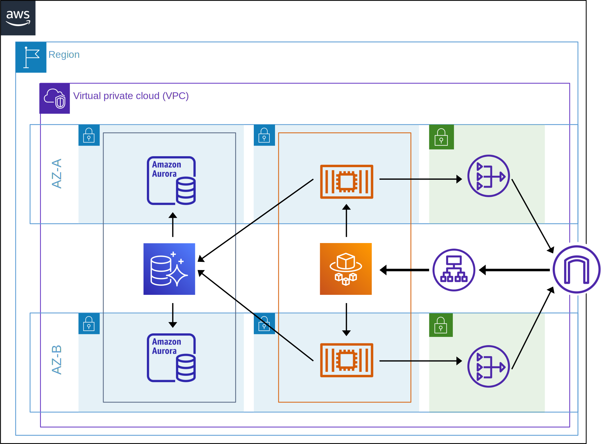
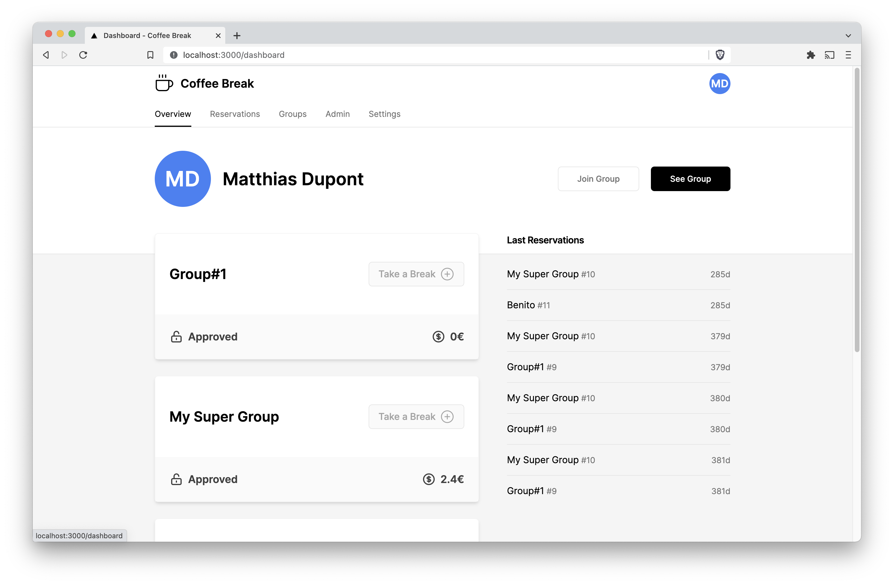
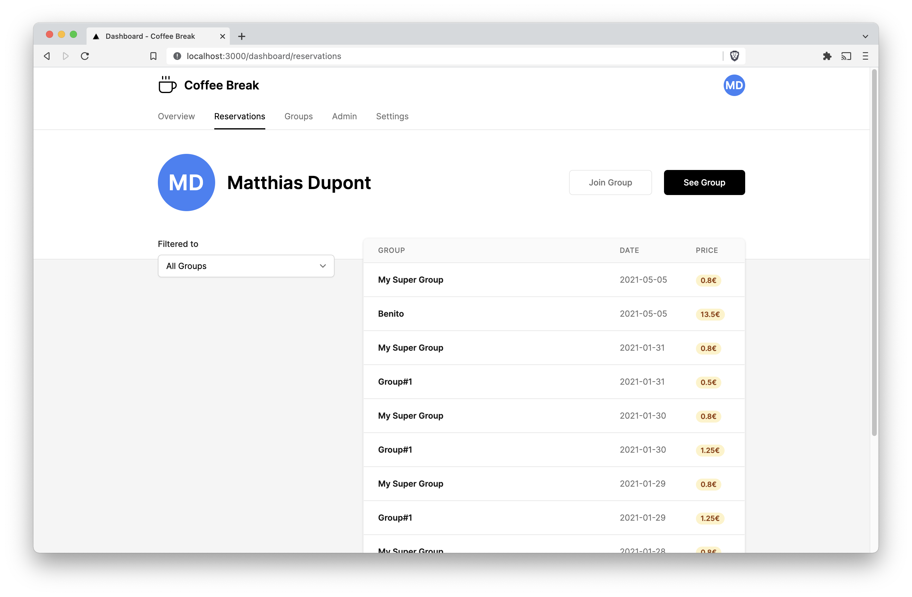
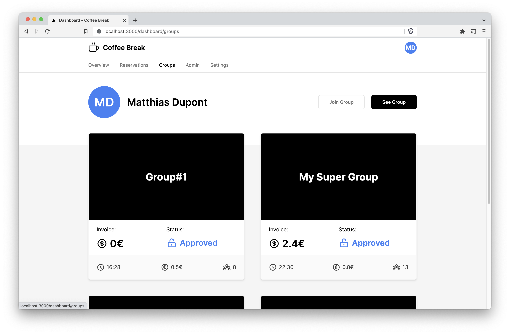
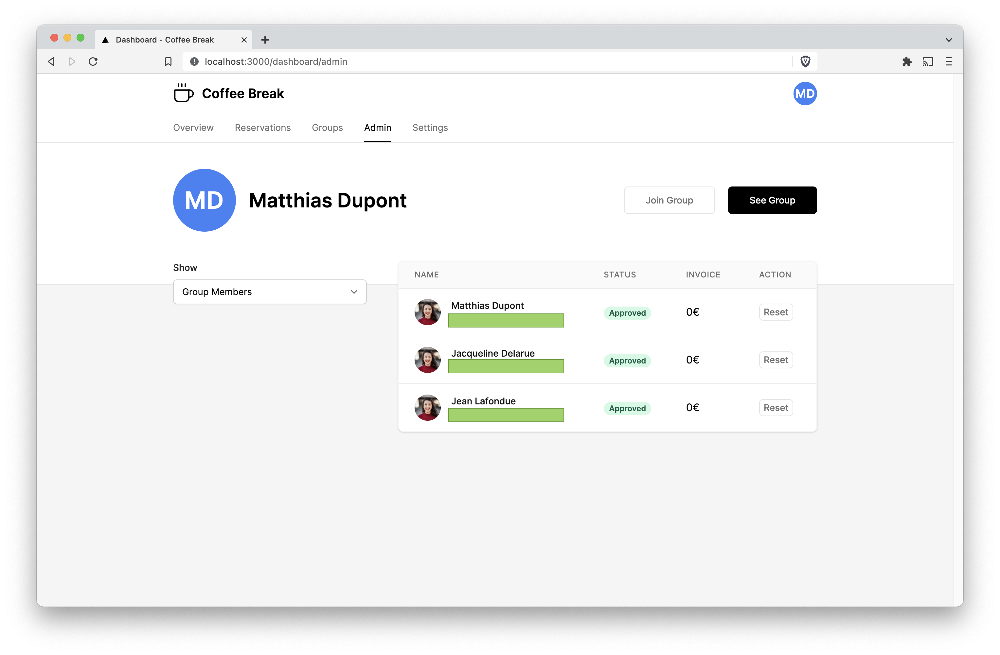

# Manage your reservations

Stack:
- Backend: Golang, AWS Aurora
- Frontend: NextJS, TailwindCSS
- Authentification: JSON Web-Tokens
- Deployment: AWS Fargate, AWS Aurora, Vercel with Terraform

## Development usage

```sh
git clone git@github.com:mlorthiois/coffee.git

# Build and run frontend
cd frontend
npm install
npm run dev
cd ..

# Build and run backend dependencies
docker-compose build
docker-compose up -d

cd backend
go run main.go
cd ..

# Build AWS infrastructure
cd terraform
terraform init
terraform apply
```

## Cloud Architecture

Cloud architecture created running Terraform.



## Website screenshots

### Account overview



### Reservations overview



### Groups overview



### Group administrator Overview



